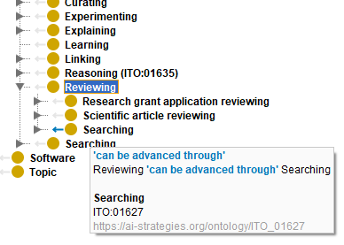

# Protege-relmod 

This fork is a simple modification of Protege Desktop 5.6-beta that I primarily created for my own purposes, but which might also be helpful for others. Modifications:

* Relationships in class hierarchy are shown in the other direction than in standard Protege, e.g. if "A has_property some B", B will be shown as a child of A in class view when relationships are displayed. I think this is the more intuitive and practical behavior for most use cases.
* The contrast and visibility of arrows indicating relationships have been improved, tooltips shown when hovering over a child class that is connected through a relationship are modified so that the relating property is better visible.
* The git integration is deactivated, as it caused performance problems with large ontologies and large Github repos.

A compiled version can be downloaded from http://samwald.info/res/Protege-5.6.0-beta-1-relmod.zip

This is just a quick hack and I'm happy for suggestions for improving this mod (e.g. better utilization of OWL API). This software is provided as-is without any warranty, please use at your own risk.

----

[Protege](http://protege.stanford.edu) is a free, open-source ontology editor that supports the latest [OWL 2.0 standard](http://www.w3.org/TR/owl2-overview/). Protege has a pluggable architecture, and many [plugins](http://protegewiki.stanford.edu/wiki/Protege_Plugin_Library) for different functionalities are available.

To read more about **Protege's features**, please visit the Protege [home page](http://protege.stanford.edu).

The latest version of Protege can be [downloaded](http://protege.stanford.edu/products.php#desktop-protege) from the Protege website, or from [github](https://github.com/protegeproject/protege-distribution/releases).

If you would like to contribute to the Protege Project please see our [contributing guide](https://github.com/protegeproject/protege/blob/master/CONTRIBUTING.md)

The [Developer Documentation](https://github.com/protegeproject/protege/wiki/Developer-Documentation) may be found on the wiki.

**Looking for support?** Please ask questions on the [protege-user](http://protege.stanford.edu/support.php) or [protege-dev](http://protege.stanford.edu/support.php) mailing lists. If you found a bug or would like to request a feature, you may also use [this issue tracker](https://github.com/protegeproject/protege/issues).

Protege is released under the [BSD 2-clause license](https://raw.githubusercontent.com/protegeproject/protege/master/license.txt).

Instructions for [building from source](https://github.com/protegeproject/protege/wiki/Building-from-Source) are available on the the wiki.
